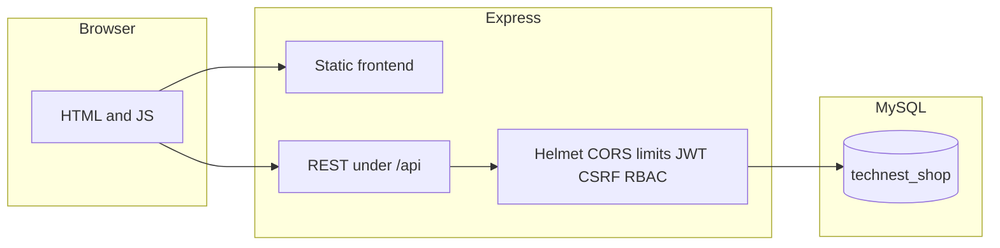

<div align="center">

# TechNest

### Secure full-stack e-commerce (cybersecurity lab)

A deliberately hardened demo shop: **JWT + httpOnly cookies**, **double-submit CSRF**, **RBAC**, **parameterized SQL**, **rate limits**, **account lockout**, **Helmet + CSP**, and **audit logs**—suitable for coursework, interviews, or a portfolio “security-first” narrative.


[Features](#key-features) · [Quick start](#quick-start) · [Architecture](#architecture) · [Steps for testing](#steps-for-testing) · [Security rubric and how to test](#security-rubric-and-how-to-test) · [Automated tests](#automated-api-test-suite)

</div>

---

## Why this project

Most student e-commerce demos stop at “it works.” TechNest is built to **show you can reason about threats**: authentication design, injection, XSS, CSRF, broken access control, brute force, and operational signals (audit trail). The README doubles as a **test plan** so reviewers (instructors, hiring managers, or meetup peers) can reproduce every claim quickly.

---

## Key features

| Area | What you get |
|------|----------------|
| **Identity** | Register / login / logout, JWT access token, rotating refresh token stored as **SHA-256 hash** in MySQL |
| **Session hardening** | `httpOnly`, `sameSite: strict`, short access TTL, optional `secure` in production |
| **CSRF** | Double-submit cookie + `X-CSRF-Token` header, constant-time compare on state-changing routes |
| **Authorization** | Role-based access: `admin` vs `user`; cart and orders scoped to the authenticated user |
| **Injection defense** | Prepared statements; **whitelist** for `ORDER BY` on product listing |
| **Abuse resistance** | Global API rate limit, stricter limits on auth/register, failed-login lockout |
| **Transport & browser policy** | Helmet, CSP, body size limits |
| **Observability** | `audit_logs` for registration, login, logout, and admin visibility |

---

## Tech stack

- **Runtime:** Node.js (LTS)
- **API:** Express 4
- **Data:** MySQL (`mysql2` / prepared statements)
- **Auth:** `jsonwebtoken`, `bcryptjs`, cookie-based refresh
- **Security middleware:** `helmet`, `cors`, `express-rate-limit`, custom CSRF + RBAC
- **Frontend:** Static HTML/JS, Tailwind via CDN, shared `apiFetch` helper with `credentials: 'include'`

---

## Architecture



Same origin in the default setup: the UI and API are served from **`http://localhost:5000`**, which simplifies cookies and CORS for local demos.

---

## Repository layout

| Path | Responsibility |
|------|----------------|
| `backend/server.js` | App bootstrap: security headers, CORS, cookies, rate limits, static files, error handler |
| `backend/routes/` | `auth`, `products`, `cart`, `orders`, `admin` |
| `backend/controllers/` | Auth, products, cart, orders, admin logic |
| `backend/middleware/` | JWT verification, RBAC, CSRF, rate limiting |
| `backend/utils/validation.js` | Regex-based validation and string sanitization |
| `frontend/` | Pages and client scripts |
| `frontend/js/config.js` | Central `fetch` wrapper: cookies + CSRF header, refresh retry |
| `database/schema.sql` / `seed.sql` | Schema and demo data |
| `setup-database.js` | One-shot DB creation and `.env` password sync |
| `backend/test-api.js` | Automated regression-style API checks for security behaviors |
| `QUICK-SETUP.bat` / `START-SERVER.bat` | Windows convenience scripts |

---

## Prerequisites

- **Node.js** (LTS)
- **npm**
- **MySQL Server** on `localhost:3306` (adjust in `.env` if different)

---

## Quick start

### Windows (recommended for first run)

1. Run **`QUICK-SETUP.bat`**, enter your MySQL **root** password when asked.  
   This applies `database/schema.sql` and `database/seed.sql`, updates `backend/.env`, starts the server, and opens the browser.
2. For later sessions with an already-provisioned DB, run **`START-SERVER.bat`**.

### Cross-platform (manual)

From the **project root**:

```bash
node setup-database.js YOUR_MYSQL_ROOT_PASSWORD
cd backend
npm install
npm run dev
```

Open **http://localhost:5000**.

### Environment

Copy `backend/.env.example` to `backend/.env` if you are setting up by hand. At minimum set **`DB_PASSWORD`**, **`JWT_ACCESS_SECRET`**, and **`JWT_REFRESH_SECRET`** to strong values before any shared or production-like deployment.

---

## Demo URLs and accounts

| Surface | URL |
|---------|-----|
| Storefront | http://localhost:5000/ |
| Login | http://localhost:5000/login.html |
| Register | http://localhost:5000/register.html |
| Admin | http://localhost:5000/admin.html |

Seeded credentials (change in a real deployment):

| Role | Username | Password |
|------|----------|----------|
| Admin | `admin` | `Admin@1234` |
| Customer | `johndoe` | `User@1234` |

---

## Steps for testing

Follow these in order the first time you test. Record **expected vs actual** (status code or screenshot) for reports or demos.

### Quick path (database already set up)

1. Start MySQL, then double-click **`START-SERVER.bat`** *or* run `cd backend` → `npm run dev`.
2. Open **http://localhost:5000** and confirm the shop loads.
3. In a second terminal at the **project root**, run **`node backend/test-api.js`**, then do **Part 3** and **Part 4** below if you need browser evidence for a rubric.

### Part 1 — Prepare the environment

1. **Start MySQL** and confirm it accepts connections on `localhost` (default port `3306`).
2. From the **project root**, run database setup once (writes `backend/.env` with your DB password):

   ```bash
   node setup-database.js YOUR_MYSQL_ROOT_PASSWORD
   ```

3. Install backend dependencies:

   ```bash
   cd backend
   npm install
   ```

4. Confirm **`backend/.env`** exists and contains **`JWT_ACCESS_SECRET`** (long random string). If you copied from `.env.example`, replace placeholder secrets.
5. **Start the API** (leave this terminal open):

   ```bash
   npm run dev
   ```

   You should see a line like `TechNest API — http://localhost:5000`. Leave the server running for Parts 2–4.

### Part 2 — Run the automated API suite

6. Open a **second** terminal at the **project root** (parent of `backend/`, not inside `backend/`).
7. Run:

   ```bash
   node backend/test-api.js
   ```

8. Read the output: each line shows **HTTP method**, **path**, and **pass (2xx)** vs **expected failure (401/403/409/423/etc.)**. Skim for any **unexpected** `500` or success where a failure was intended.
9. Optional: run with verbose JSON (PowerShell):

   ```powershell
   $env:VERBOSE = "1"
   node backend/test-api.js
   ```

   The script already covers: public products, registration edge cases, SQLi-style login, admin vs user flows, cart, orders, IDOR-style cart delete, RBAC (**403**), unauthenticated access (**401**), and validation.

### Part 3 — Manual functional tests (browser)

10. Open **http://localhost:5000/** and confirm products load.
11. Open **http://localhost:5000/register.html**, create an account with a **strong** password (uppercase, lowercase, number, special character, 8+ chars). Confirm success or clear error messages.
12. Try registering again with the **same** username or email → expect **conflict** / error (duplicate).
13. Open **http://localhost:5000/login.html**, log in as **`johndoe` / `User@1234`**, browse products, **add to cart**, open cart, **place an order** with a full shipping address (at least 10 characters).
14. Open **http://localhost:5000/orders.html** (or your orders page) and confirm the new order appears.
15. **Log out** from the UI if available, or use admin later; confirm the storefront behaves for a logged-out user (e.g. cart requires login).

### Part 4 — Manual security tests (browser + DevTools)

Use **Chrome/Edge DevTools** (F12): **Application** tab for cookies, **Network** tab for status codes and request headers.

16. **HttpOnly access token:** Log in as `johndoe`. Go to **Application → Cookies → http://localhost:5000**. Select `access_token` and confirm **HttpOnly** is checked. In **Console**, run `document.cookie` and confirm **`access_token` does not appear** in the string.
17. **CSRF header on writes:** With DevTools **Network** open, add an item to the cart (or any action that `POST`s). Click the request → **Headers** → confirm request includes **`X-CSRF-Token`** (and **Cookie** includes `csrf_token`).
18. **CSRF rejection (optional):** Stay logged in. In **Console**, run a fetch **without** the CSRF header, for example:

   ```javascript
   fetch('/api/cart', { method: 'POST', credentials: 'include', headers: { 'Content-Type': 'application/json' }, body: JSON.stringify({ product_id: 1, quantity: 1 }) })
     .then(r => r.json()).then(console.log)
   ```

   Expect **`403`** and a message about CSRF in the JSON (normal UI uses `apiFetch`, which adds the header).

19. **CSP / Helmet:** In **Network**, click the first **document** request for `localhost:5000` → **Headers → Response Headers**. Confirm **`content-security-policy`** (or related Helmet headers) is present.
20. **Anonymous access:** Open **Application → Storage → Clear site data** (or use a fresh private window without logging in). Visit the shop; then try to open **cart** or trigger a protected API. Expect **redirect to login** or **401** on API calls.
21. **RBAC — user vs admin:** In a normal window, log in as **`johndoe`**. Try to open **http://localhost:5000/admin.html**. Expect redirect away from admin **or** admin UI failing to load data; in **Network**, requests to **`/api/admin/...`** should show **403**.
22. **RBAC — admin works:** Log out, log in as **`admin` / `Admin@1234`**, open **admin.html**, load dashboard, users, and **audit logs**. Confirm data loads (**200**).
23. **Audit trail:** While still admin, perform a login or register from another window, refresh **audit logs**, and confirm new rows (e.g. `USER_LOGIN`).
24. **Password hashing (optional):** In MySQL Workbench or CLI, run  
    `SELECT username, LEFT(password_hash, 20) FROM technest_shop.users WHERE username='johndoe';`  
    Confirm `password_hash` looks like a **bcrypt** string, not plaintext `User@1234`.
25. **Account lockout (optional lab):** On a **test** user only, enter the wrong password **five times** in a row. Expect **lockout** (**423**) message. Wait for the lockout window to expire (see server/auth logic) or reset the row in DB before demoing again.
26. **Rubric crosswalk:** For any course rubric row, use the tables in [Security rubric and how to test](#security-rubric-and-how-to-test) and the [Master checklist](#master-checklist-copy-for-your-report) to tick off each item after you complete the matching step above.

### Part 5 — Rubric quick map (which step covers what)

| Rubric theme | Manual step(s) | Automated (`test-api.js`) |
|--------------|----------------|---------------------------|
| **R1** Authentication, httpOnly JWT, logout | 16, 15 + logout; refresh after expiry is **B** only (shorten `JWT_ACCESS_EXPIRY`) | Login, `/auth/me`, logout; does **not** call `/auth/refresh` explicitly |
| **R2** Password rules, lockout, register rate limit | 11–12; 25 for lockout | Weak password, duplicate register |
| **R3** SQL injection (login, sort) | (optional) repeat in Network with bad payloads | SQLi-style login; malicious `sort` query |
| **R4** XSS-style input, CSP | 11; 19 | Script-like username |
| **R5** CSRF | 17–18 | Uses `X-CSRF-Token` on state-changing calls |
| **R6** RBAC, IDOR, anonymous | 20–22 | User vs admin; `DELETE /cart/999`; no-auth calls |
| **R7** Rate limits, body size | (optional) scripted flood; large POST | Not all limits fully exercised in script |
| **R8** Helmet / CORS | 19; CORS needs separate origin page | Headers indirectly present on responses |
| **R9** Audit logs, safe errors | 22–23 | Admin audit fetch in script |
| **R10** Input validation | 11, 13 | Oversized login identifier and related cases |

Run **Part 2** first so API-level rubric items are checked in one pass; use **Part 4** for anything your grader wants shown in a **browser** (cookies, Network tab, Console `fetch`).

---

## Screenshots (optional for your portfolio)

Add a `docs/screenshots/` folder (or use GitHub’s image drag-and-drop on a PR) with:

1. Storefront with products  
2. Login page and cookie panel showing **HttpOnly** access token  
3. Admin dashboard and **Audit logs**  
4. Network tab showing **`X-CSRF-Token`** on a `POST`  

That instantly signals “this is a real UI project” on LinkedIn or GitHub.

---

## Security rubric and how to test

Below is a **portfolio- and grading-friendly** rubric. Each row states the **claim**, **where it lives in code**, **how to verify**, and the **expected outcome**. Your course might use different wording; map their rows to these tests and paste screenshots or HTTP traces as evidence.

Legend: **A** = automated (`test-api.js`), **B** = browser, **C** = curl/HTTP client, **D** = database client.

### R1 — Authentication and session design

| # | Rubric item | Implementation | How to test | Expected |
|---|-------------|------------------|-------------|----------|
| R1.1 | Passwords never stored plaintext | `bcrypt.hash` in `backend/controllers/auth.controller.js` | **D:** `SELECT username, password_hash FROM users WHERE username='johndoe';` | Long bcrypt string, not the literal password |
| R1.2 | Access token not readable from JavaScript | httpOnly `access_token` cookie | **B:** DevTools → Application → Cookies → `access_token` has **HttpOnly**. Console: `document.cookie` does not contain `access_token` | HttpOnly checked; token absent from `document.cookie` |
| R1.3 | Short-lived access JWT + refresh path | `generateAccessToken`, `refreshToken` in auth controller | **A:** script logs in then hits flows using cookies; **B:** after shortening `JWT_ACCESS_EXPIRY` in `.env`, idle until expiry then trigger a protected page—client retries refresh once (`frontend/js/config.js`) | Refresh extends session without re-login when refresh cookie valid |
| R1.4 | Logout clears server-side refresh | `DELETE FROM refresh_tokens` on logout | Login, logout with valid CSRF, then `POST /api/auth/refresh` with remaining cookies | **401** invalid or expired refresh |

**Automated:** login, `/auth/me`, logout, unauthenticated calls — **A**.

---

### R2 — Password quality and account lockout

| # | Rubric item | Implementation | How to test | Expected |
|---|-------------|------------------|-------------|----------|
| R2.1 | Strong password rules | `validateRegistration` in `backend/utils/validation.js` | `POST /api/auth/register` with password `weakpass` | **400** with validation errors |
| R2.2 | Brute-force discouragement | `authLimiter` in `backend/middleware/rateLimiter.middleware.js`; lockout after repeated failures in auth controller | Wrong password for `johndoe` five times | **423** lockout message; after window, valid password works |
| R2.3 | Registration spam control | `registerLimiter` (5 / hour / IP) | More than five distinct register attempts from same IP in one hour | **429** rate-limit JSON |

**Automated:** weak password and duplicate register — **A**.

---

### R3 — SQL injection

| # | Rubric item | Implementation | How to test | Expected |
|---|-------------|------------------|-------------|----------|
| R3.1 | Parameterized auth queries | `db.execute` with `?` placeholders | `POST /api/auth/login` with body `identifier`: `admin' OR '1'='1' --`, any password | **401** invalid credentials, no admin session |
| R3.2 | No user-controlled `ORDER BY` | `ALLOWED_SORTS` whitelist in `backend/controllers/product.controller.js` | `GET /api/products?sort=DROP TABLE users;--` | **200** JSON list; database intact; no SQL syntax error exposed to client |

**Automated:** both scenarios — **A**.

---

### R4 — Cross-site scripting (XSS)

| # | Rubric item | Implementation | How to test | Expected |
|---|-------------|------------------|-------------|----------|
| R4.1 | Reject script-like usernames at registration | Username regex in `validation.js` | `POST /api/auth/register` with username `<script>alert(1)</script>` | **400** |
| R4.2 | Defense in depth: CSP | `helmet` CSP in `backend/server.js` | **B:** Network → first document → Response headers | `Content-Security-Policy` present |
| R4.3 | Safer DOM updates where helpers used | `textContent` / `safeText` in `frontend/js/config.js` | Code review + avoid pasting unsanitized HTML into new UI | No reflected XSS in flows using helpers |

**Automated:** R4.1 — **A**.

---

### R5 — Cross-site request forgery (CSRF)

| # | Rubric item | Implementation | How to test | Expected |
|---|-------------|------------------|-------------|----------|
| R5.1 | State-changing routes require matching token | `verifyCsrf` in `backend/middleware/csrf.middleware.js`; applied on cart, auth logout/profile, admin mutations | While logged in, send `POST /api/cart` with cookies but **omit** header `X-CSRF-Token` | **403** `CSRF token missing` |
| R5.2 | Timing-safe comparison | `crypto.timingSafeEqual` in CSRF middleware | Send wrong token same length as valid hex | **403** invalid CSRF |

**B:** Normal UI uses `apiFetch` which attaches `X-CSRF-Token` from the readable `csrf_token` cookie after login.

---

### R6 — Authorization, RBAC, and IDOR

| # | Rubric item | Implementation | How to test | Expected |
|---|-------------|------------------|-------------|----------|
| R6.1 | Admin APIs reject normal users | `requireAdmin` in `backend/routes/admin.routes.js` | Login as `johndoe`, `GET /api/admin/users` with browser session or copied cookies | **403** insufficient permissions |
| R6.2 | Protected resources reject anonymous | `verifyToken` on cart, orders, admin | Clear site data; `GET /api/cart` | **401** |
| R6.3 | Cart row access tied to owner | Cart controller scopes by `user_id` | As `johndoe`, `DELETE /api/cart/999` | **404** (not found for this user), not a silent success on someone else’s row |

**Automated:** R6.1–R6.3 — **A**.

---

### R7 — Rate limiting and denial-of-service hygiene

| # | Rubric item | Implementation | How to test | Expected |
|---|-------------|------------------|-------------|----------|
| R7.1 | Global API throttling | `apiLimiter` on `/api/` in `server.js` | Flood non-skipped endpoints with a script | **429** after threshold |
| R7.2 | Small JSON bodies | `express.json({ limit: '10kb' })` | `POST` very large JSON to any API route | Rejected by parser / connection error per client |

---

### R8 — HTTP headers and CORS

| # | Rubric item | Implementation | How to test | Expected |
|---|-------------|------------------|-------------|----------|
| R8.1 | Baseline secure headers | `helmet` in `server.js` | **B:** Inspect response headers on any HTML or API response | Multiple `X-*` and CSP-related headers from Helmet |
| R8.2 | CORS aligned to frontend origin | `cors({ origin: FRONTEND_URL, credentials: true })` | Open a `file://` or other-origin page that tries credentialed `fetch` to your API | Browser blocks with CORS error |
| R8.3 | HSTS when production | `hsts` gated on `NODE_ENV === 'production'` | Run with `NODE_ENV=production` behind HTTPS in real deploy | `Strict-Transport-Security` present |

---

### R9 — Auditability and safe errors

| # | Rubric item | Implementation | How to test | Expected |
|---|-------------|------------------|-------------|----------|
| R9.1 | Security events auditable | `audit_logs` inserts on register, login, logout | Login as admin → Admin UI or `GET /api/admin/audit-logs` | Rows such as `USER_LOGIN`, `USER_REGISTERED` |
| R9.2 | No stack traces to clients | Global error handler in `server.js` | Trigger **500** (only in a controlled lab) | Generic JSON error, details only in server logs |

---

### R10 — Input validation (business rules)

| # | Rubric item | Implementation | How to test | Expected |
|---|-------------|------------------|-------------|----------|
| R10.1 | Login identifier length bound | `validateLogin` | `POST /api/auth/login` with 200-character identifier | **400** |
| R10.2 | Cart and order payloads validated | `validateCartItem`, `validateOrder` | Invalid `product_id` / quantity / short address | **400** with structured errors |

**Automated:** oversized login identifier — **A**.

---

## Master checklist (copy for your report)

Use this as a single-page verification list. Check each box during your demo recording.

- [ ] **R1** Passwords are bcrypt hashes in DB; access token is httpOnly; refresh revoked on logout
- [ ] **R2** Weak password rejected; repeated failures lock account; registration rate limited
- [ ] **R3** Classic SQLi login string does not bypass auth; malicious `sort` does not break DB
- [ ] **R4** Script username rejected; CSP header visible in Network tab
- [ ] **R5** Cart POST without `X-CSRF-Token` returns **403**
- [ ] **R6** User cannot hit admin APIs; anonymous cannot hit cart; foreign cart id returns **404**
- [ ] **R7** Sustained traffic eventually yields **429**; large body rejected
- [ ] **R8** Helmet headers present; cross-origin credentialed call fails as expected
- [ ] **R9** Audit log shows your recent actions; API never returns stack traces
- [ ] **R10** Garbage inputs return **400** with clear validation feedback

---

## Automated API test suite

This is the same flow as **[Steps for testing](#steps-for-testing) → Part 2** (steps 6–9).

Terminal 1:

```bash
cd backend
npm run dev
```

Terminal 2 (from **project root**):

```bash
node backend/test-api.js
```

You should see grouped scenarios (public catalog, auth edge cases, admin vs user, cart, orders, bypass attempts) with pass/fail style logging. For verbose JSON snippets:

**Windows (PowerShell):**

```powershell
$env:VERBOSE = "1"
node backend/test-api.js
```

**macOS / Linux:**

```bash
VERBOSE=1 node backend/test-api.js
```

If the server is down, the script exits with a connection error—start `npm run dev` first.


---

## Troubleshooting

| Symptom | What to check |
|---------|----------------|
| Database setup fails with `ECONNREFUSED` | MySQL service running; host/port in `.env` |
| `ER_ACCESS_DENIED_ERROR` | Root password passed to `setup-database.js` matches MySQL |
| Persistent **401** after login | `JWT_ACCESS_SECRET` set and stable; clear cookies and log in again |
| Console CSP warnings for CDNs | Expected to some degree; `server.js` whitelists the CDNs used by this demo |

---

## Ethics and scope

Use this project only on **systems you own or are explicitly authorized** to test. It is an educational artifact, not a turnkey production storefront.
